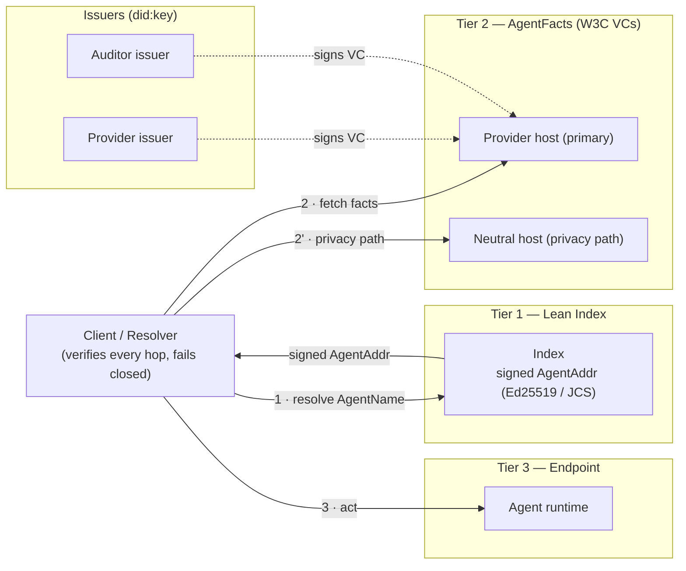
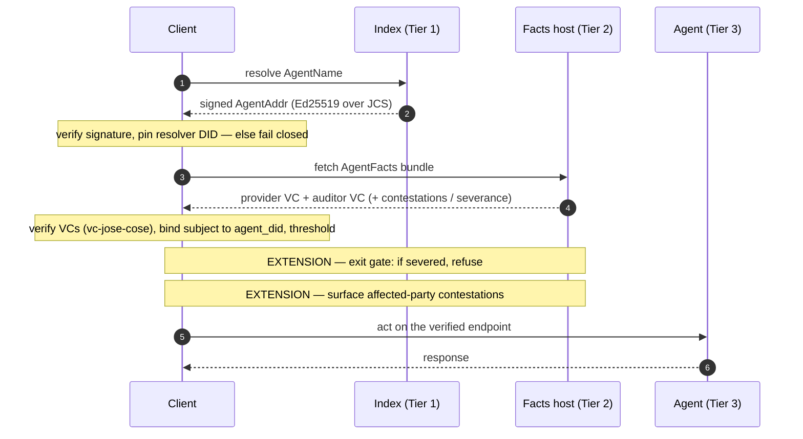
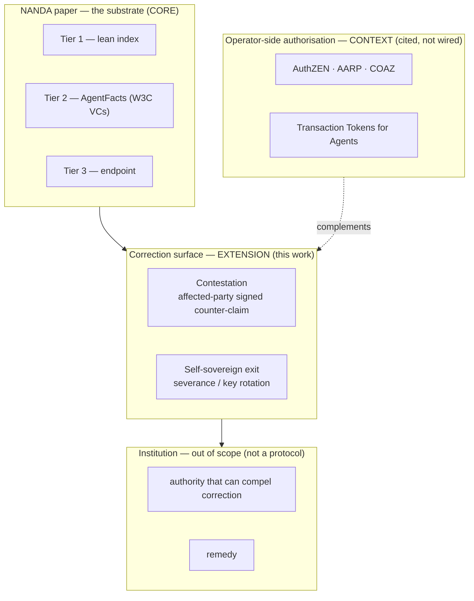
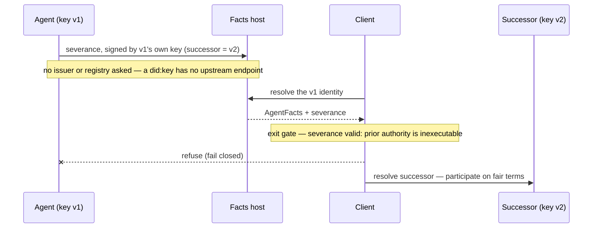
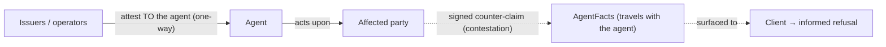
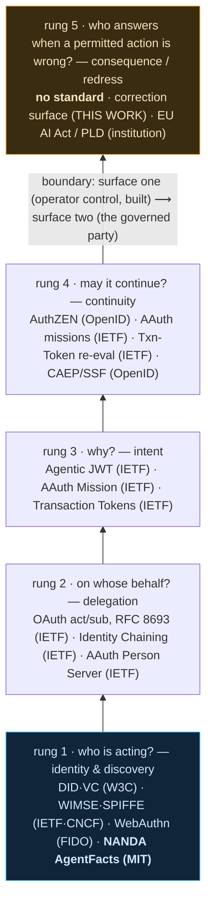

# Diagrams

Architecture and flow diagrams (Mermaid — render inline on GitHub). The protocol
explorer (`explorer/`) renders the same flows interactively, step-by-step, with real
in-process crypto.

## 1. Architecture — three tiers + the correction surface

## 2. Resolution — sequence (including the extension hops)

## 3. The layered model — where the boundary sits

## 4. Self-sovereign exit (severance / key rotation)

## 5. Trust direction — operator side vs. the governed party

## 6. Where NANDA sits — the agent-stack ladder

Agent-identity standards answer five questions, bottom to top. The corpus covers
rungs 1–4 — the operator's **control surface** — and stops at rung 5, the governed
party's **correction surface**, by charter. NANDA sits at rung 1 (identity &
discovery); this work's correction surface is a protocol-layer attempt at the empty
rung 5. Steward attributions are verified against primary sources; the explorer
renders this interactively at <https://anivar.github.io/nanda-correction-surface/>.

Each standard linked to its primary source:

| Rung | Question | Standards (steward) |
|---|---|---|
| **1 · identity** | who is acting? | [DID](https://www.w3.org/TR/did-core/) · [VC](https://www.w3.org/TR/vc-data-model-2.0/) (W3C) · [WIMSE](https://datatracker.ietf.org/wg/wimse/) (IETF) · [SPIFFE](https://spiffe.io/) (CNCF) · [WebAuthn](https://fidoalliance.org/passkeys/) (FIDO) · [NANDA AgentFacts](https://arxiv.org/abs/2507.14263) (MIT) |
| **2 · delegation** | on whose behalf? | [OAuth Token Exchange — RFC 8693](https://www.rfc-editor.org/rfc/rfc8693) · [Identity Chaining](https://datatracker.ietf.org/doc/draft-ietf-oauth-identity-chaining/) · [AAuth](https://datatracker.ietf.org/doc/draft-hardt-oauth-aauth-protocol/) (IETF) |
| **3 · intent** | why? | [Agentic JWT](https://datatracker.ietf.org/doc/draft-goswami-agentic-jwt/) · AAuth Mission · [Transaction Tokens](https://datatracker.ietf.org/doc/draft-ietf-oauth-transaction-tokens/) (IETF) |
| **4 · continuity** | may it continue? | [AuthZEN](https://openid.net/wg/authzen/) · [CAEP / Shared Signals](https://openid.net/wg/sse/) (OpenID) · AAuth missions · Transaction Tokens re-eval (IETF) |
| **5 · consequence** | who answers when a permitted action is wrong? | — no standards-body spec — · **correction surface (this work)** · [EU AI Act](https://digital-strategy.ec.europa.eu/en/policies/regulatory-framework-ai) (institution) |

Riding on rungs 1–4 (not part of the authority ladder): [A2A](https://a2a-protocol.org/)
agent↔agent (LF) · [MCP](https://modelcontextprotocol.io/) tool access (LF/AAIF) ·
[AP2](https://ap2-protocol.org/) payments (LF/Google); security & threats:
[OWASP GenAI](https://genai.owasp.org/), [CoSAI](https://www.coalitionforsecureai.org/)
(OASIS), [NIST](https://www.nist.gov/). NANDA's AgentFacts is a superset of the A2A
Agent Card.
