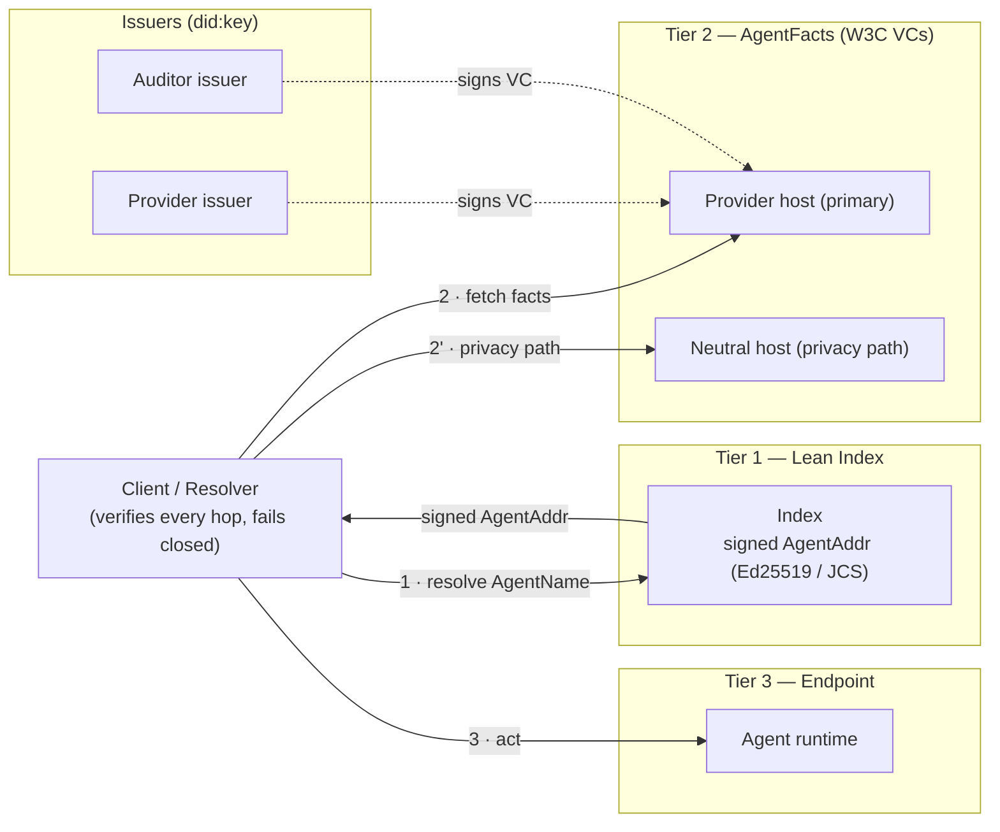
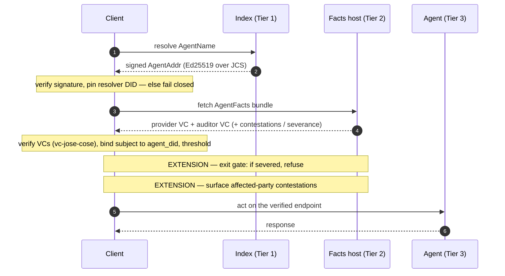
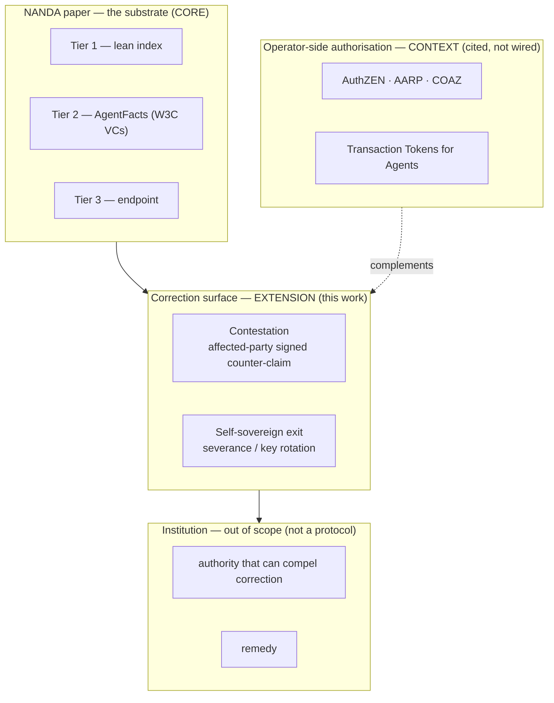
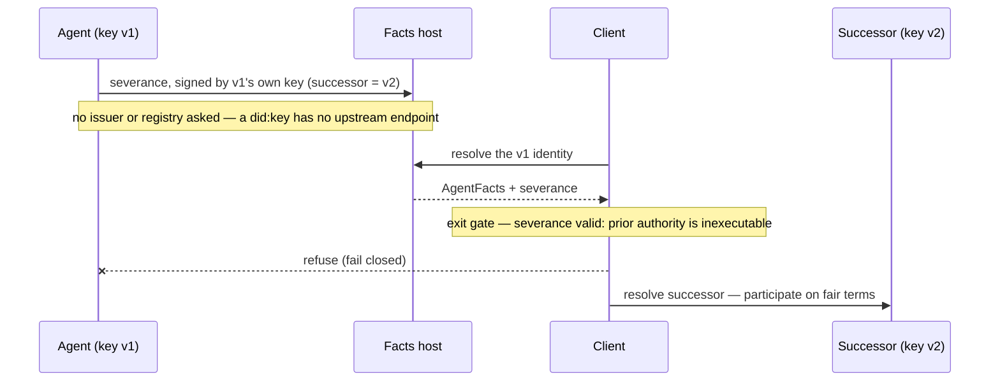
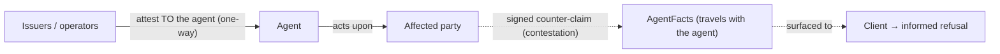

# Diagrams

Architecture and flow diagrams (Mermaid — render inline on GitHub). The protocol
explorer (`explorer/`) renders the same flows interactively, step-by-step, with real
in-process crypto.

## 1. Architecture — three tiers + the correction surface

## 2. Resolution — sequence (including the extension hops)

## 3. The layered model — where the boundary sits

## 4. Self-sovereign exit (severance / key rotation)

## 5. Trust direction — operator side vs. the governed party

